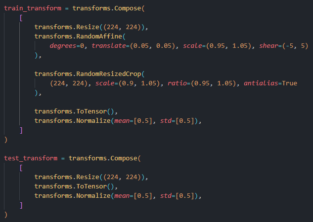

<a id="readme-top"></a>

[![Contributors][contributors-shield]][contributors-url]
[![Forks][forks-shield]][forks-url]
[![Stargazers][stars-shield]][stars-url]
[![Issues][issues-shield]][issues-url]
[![project_license][license-shield]][license-url]
[![LinkedIn][linkedin-shield]][linkedin-url]


<!-- PROJECT LOGO -->
<br />
<div align="center">
  <a href="https://github.com/HappyPotatoHead/Signature-Verification-Model">
    
  </a>

<h3 align="center">Signature Verification Model</h3>

  <p align="center">
    This project aimed to develop a model to efficiently verifying handwritten signatures. <br>The challenge was to accurately compare scanned or captured signatures against known samples, even with variations in style and quality. 
    <br>With this model, the process of verifying valid signatures can be significantly shorter and less tedious.
    <br />
    <a href="https://github.com/HappyPotatoHead/Signature-Verification-Model"><strong>Explore the docs »</strong></a>
    <br />
    <br />
    <a href="https://github.com/HappyPotatoHead/Signature-Verification-Model">View Demo</a>
    &middot;
    <a href="https://github.com/HappyPotatoHead/Signature-Verification-Model/issues/new?labels=bug&template=bug-report---.md">Report Bug</a>
  </p>
</div>

<!-- TABLE OF CONTENTS -->
<details>
  <summary>Table of Contents</summary>
  <ol>
    <li>
      <a href="#about-the-project">About The Project</a>
      <ul>
        <li><a href="#built-with">Built With</a></li>
      </ul>
    </li>
    <li>
      <a href="#getting-started">Getting Started</a>
      <ul>
        <li><a href="#prerequisites">Prerequisites</a></li>
        <li><a href="#installation">Installation</a></li>
      </ul>
    </li>
    <li><a href="#usage">Usage</a></li>
    <li><a href="#roadmap">Roadmap</a></li>
    <li><a href="#contributing">Contributing</a></li>
    <li><a href="#license">License</a></li>
    <li><a href="#contact">Contact</a></li>
    <li><a href="#acknowledgments">Acknowledgments</a></li>
  </ol>
</details>

<!-- ABOUT THE PROJECT -->
## About The Project

[![Product Name Screen Shot][product-screenshot]](https://example.com)

Here's a blank template to get started. To avoid retyping too much info, do a search and replace with your text editor for the following: `github_username`, `repo_name`, `twitter_handle`, `linkedin_username`, `email_client`, `email`, `project_title`, `project_description`, `project_license`

<p align="right"><a href="#readme-top">back to top</a></p>


### Built With

* [![Python][Python]][Python-url]
* [![PyTorch][PyTorch]][PyTorch-url]
* [![NumPy][NumPy]][NumPy]
* [![Matplotlib][Matplotlib]][Matplotlib-url]

<p align="right"><a href="#readme-top">back to top</a></p>


<!-- GETTING STARTED -->
## Getting Started

### Prerequisites

Install the libraries listed in `requirements.txt`. The version of PyTorch used can be found in the [notebook](https://github.com/HappyPotatoHead/Signature-Verification-Model/blob/main/resnet_model.ipynb)

* Python
  ```sh
  pip install -r requirements.txt
  ```

### Installation

Just clone the repository and you are good to go!

```sh
git clone https://github.com/HappyPotatoHead/Signature-Verification-Model.git
```

Change git remote url to avoid accidental pushes to base project
```sh
git remote set-url origin HappyPotatoHead/Signature-Verification-Model
git remote -v # confirm the changes
```

<p align="right"><a href="#readme-top">back to top</a></p>


<!-- USAGE EXAMPLES -->
## Usage

> Using the notebook is rather straightforward, so I will mainly cover the parts that you can *play around with*.

Check out [The Garden](https://happypotatohead.github.io/project-garden/AI--and--Deep-Learning/Offline-Signature-Verification-System) to learn more!

Modify the **Configurations** section to control the training of the model.


`build_feature_extraction_model()` and `build_batch_triplet_loss` are used to define the model and the triplet loss function. 

 

Proceed to **Define Transforms** section to define transformers. 



<p align="right"><a href="#readme-top">back to top</a></p>


<!-- ROADMAP -->
## Roadmap

See the [open issues](https://github.com/HappyPotatoHead/Signature-Verification-Model/issues) for a full list of proposed features (and known issues).

<p align="right"><a href="#readme-top">back to top</a></p>


<!-- CONTRIBUTING -->
## Contributing

Contributions are what make the open source community such an amazing place to learn, inspire, and create. Any contributions you make are **greatly appreciated**.

If you have a suggestion that would make this better, please fork the repo and create a pull request. You can also simply open an issue with the tag "enhancement".
Don't forget to give the project a star! Thanks again!

1. Fork the Project
2. Create your Feature Branch (`git checkout -b feature/AmazingFeature`)
3. Commit your Changes (`git commit -m 'Add some AmazingFeature'`)
4. Push to the Branch (`git push origin feature/AmazingFeature`)
5. Open a Pull Request

<p align="right"><a href="#readme-top">back to top</a></p>

### Top contributors:

<a href="https://github.com/HappyPotatoHead/Signature-Verification-Model/graphs/contributors">
  
</a>

<!-- LICENSE -->
## License

Distributed under the project_license. See `LICENSE.txt` for more information.

<p align="right"><a href="#readme-top">back to top</a></p>


<!-- CONTACT -->
## Contact

Jimmy Ding - jimmydingjk@gmail.com

Project Link: [Signature-Verification-Model](https://github.com/HappyPotatoHead/Signature-Verification-Model)

<p align="right"><a href="#readme-top">back to top</a></p>


<!-- MARKDOWN LINKS & IMAGES -->
<!-- https://www.markdownguide.org/basic-syntax/#reference-style-links -->
[contributors-shield]: https://img.shields.io/github/contributors/HappyPotatoHead/Signature-Verification-Model.svg?style=for-the-badge
[contributors-url]: https://github.com/HappyPotatoHead/Signature-Verification-Model/graphs/contributors
[forks-shield]: https://img.shields.io/github/forks/HappyPotatoHead/Signature-Verification-Model.svg?style=for-the-badge
[forks-url]: https://github.com/HappyPotatoHead/Signature-Verification-Model/network/members
[stars-shield]: https://img.shields.io/github/stars/HappyPotatoHead/Signature-Verification-Model.svg?style=for-the-badge
[stars-url]: https://github.com/HappyPotatoHead/Signature-Verification-Model/stargazers
[issues-shield]: https://img.shields.io/github/issues/HappyPotatoHead/Signature-Verification-Model.svg?style=for-the-badge
[issues-url]: https://github.com/HappyPotatoHead/Signature-Verification-Model/issues
[license-shield]: https://img.shields.io/github/license/HappyPotatoHead/Signature-Verification-Model.svg?style=for-the-badge
[license-url]: https://github.com/HappyPotatoHead/Signature-Verification-Model/blob/master/LICENSE.txt
[linkedin-shield]: https://img.shields.io/badge/-LinkedIn-black.svg?style=for-the-badge&logo=linkedin&colorB=555
[linkedin-url]: https://linkedin.com/in/linkedin_username
[product-screenshot]: images/screenshot.png

[Python]: https://img.shields.io/badge/Python-3776AB?logo=python&logoColor=fff
[Python-url]: https://www.python.org/

[Matplotlib]: https://custom-icon-badges.demolab.com/badge/Matplotlib-71D291?logo=matplotlib&logoColor=fff
[Matplotlib-url]: https://matplotlib.org/

[NumPy]: https://img.shields.io/badge/NumPy-4DABCF?logo=numpy&logoColor=fff
[NumPy-url]: https://numpy.org/

[PyTorch]: https://img.shields.io/badge/PyTorch-ee4c2c?logo=pytorch&logoColor=white
[PyTorch-url]: https://docs.pytorch.org/docs/stable/index.html

[Scikit-learn]: https://img.shields.io/badge/-scikit--learn-%23F7931E?logo=scikit-learn&logoColor=white
[Scikit-learn]: https://scikit-learn.org/stable/